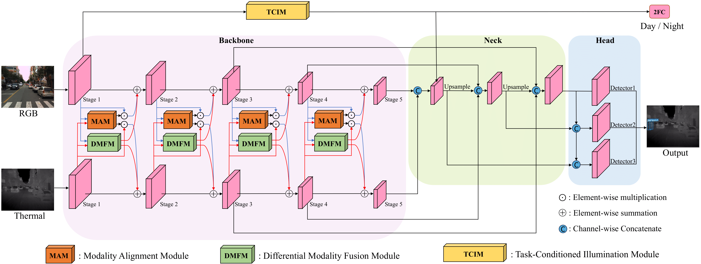
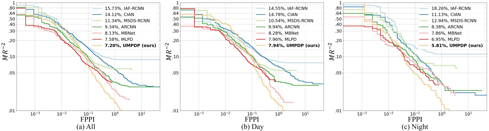
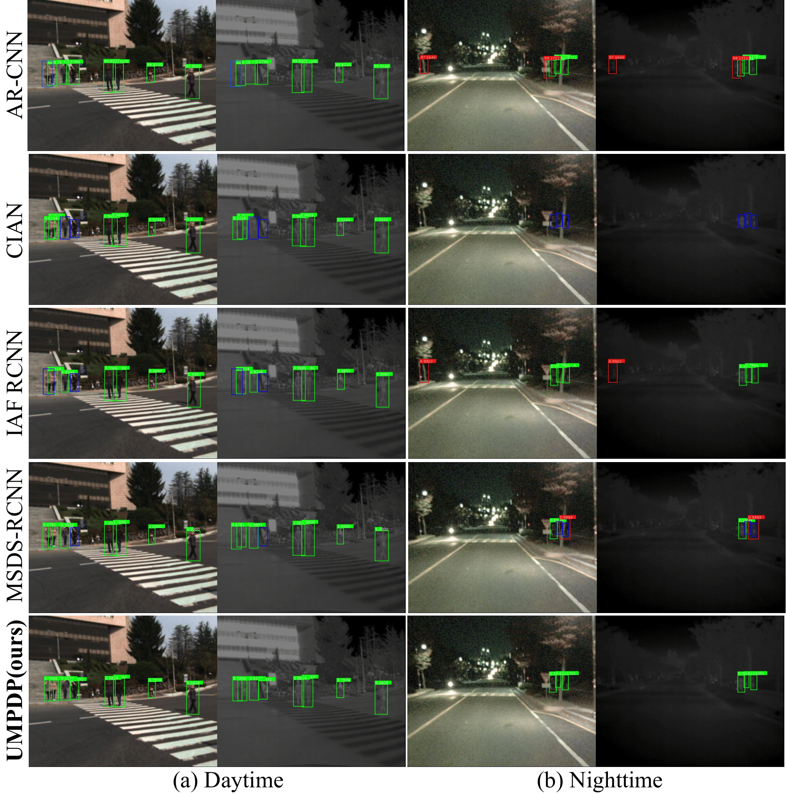

# Rethinking Multispectral Pedestrian Detection Challenges: A Universal Paradigm

Pytorch implementation of "Rethinking Multispectral Pedestrian Detection Challenges: A Universal Paradigm"


## Changelog
- [x] Release the initial result for UMPDP. [2024-05-08]
- [ ] Release the initial result for UMPDP. [Come Soon]


## Introduction



Our main contributions are:
- We summarize **four crucial challenges** in multispectral pedestrian detection, including uncertain fusion timing, misaligned feature spaces, ineffective fusion strategies, and inaccurate illumination predictions.
- We propose a Universal Multispectral Pedestrian Detection Paradigm (UMPDP) that alleviates the four key challenges mentioned above.
- UMPDP achieves the **state-of-the-art** results on both the public KAIST and CVC-14 multispectral pedestrian datasets with real-time detection speed.

## Quantitative results


Compared to other methods, our proposed UMPDP exhibits lower miss rates in all-day scenes, daytime scenes, and nighttime scenes.
What's more, we provide the detection results of UMPDP model for [KAIST dataset](https://soonminhwang.github.io/rgbt-ped-detection/). 


You can also call the function below to quickly draw a comparison chart of the MR results from different methods.

```
cd evaluation_script
```

```
python evaluation_script.py  --annFile KAIST_annotation.json  --rstFile state_of_arts/ARCNN_result.txt state_of_arts/CIAN_result_new.txt state_of_arts/UMPDP_rethinking.txt state_of_arts/IAF-RCNN_.txt state_of_arts/MBNet_result.txt state_of_arts/MLPD_result.txt state_of_arts/MSDS-RCNN_result.txt  --evalFig UMPDP.jpg
```

## Visualize results

In the visualization results, green represents TP (True Positives), red represents FP (False Positives), and blue represents FN (False Negatives). It can be observed that, compared to other methods, our proposed UMPDP achieves better results.


